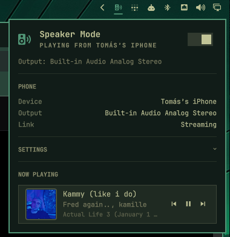

# Speaker Mode

An Omarchy bar widget that turns your machine into a Bluetooth speaker for your
phone. Flip it on, pick the machine in your phone's Bluetooth output list, and
whatever the phone plays comes out of your speakers — with cover art, media
controls, volume sync and message notifications on the desktop.



Works with any phone. Everything it uses is a standard Bluetooth profile —
A2DP, AVRCP, MAP, HFP — so Android and iOS take the same path.

## What it does

- **Plays your phone's audio** through this machine's speakers, over A2DP
- **Cover art** pulled from the phone over Bluetooth, with a click-to-expand card
- **Media controls** — play, pause, skip, and your existing media keys
- **Volume mirroring** — turn the phone up and the stream here follows, and back
- **Message notifications** — texts from the phone appear on the desktop
- **Microphone for calls** — choose which capture device the phone uses, on
  phones that offer this machine an HFP link
- **Output selection** — send the phone to any output, independently of the rest
  of your desktop audio

## The bar icon

| Icon | Meaning |
|------|---------|
| dimmed crossed-out speaker | Off — phone audio is blocked |
| speaker with a Bluetooth mark | On — armed, waiting or connected |
| speaker with sound waves, theme accent | Audio is playing right now |

## Requirements

Everything below ships with Omarchy except the first two, which are needed for
cover art. Without them the plugin works fine and simply shows a placeholder
instead of artwork.

```bash
sudo pacman -S bluez-obex
sudo sed -i 's/^#\?Experimental = false/Experimental = true/' /etc/bluetooth/main.conf
sudo systemctl restart bluetooth
systemctl --user enable --now obex
```

`bluez-obex` provides the OBEX daemon that fetches cover art, and
`Experimental = true` is what makes BlueZ publish the image handle the phone
sends. Also required, and already present on a stock install: `bluez`,
`bluez-utils`, `pipewire`, `pipewire-pulse`, `wireplumber`, `jq`, and
`python-gobject`.

For message notifications, the phone has to grant notification access. iOS asks
once, per device: Settings → Bluetooth → ⓘ next to this machine → allow
notifications.

## What this plugin runs

Omarchy plugins run unsandboxed with your user's permissions, so here is
everything this one does, in full.

**Background services.** Three transient systemd *user* units, started when
speaker mode is on and stopped when it is off, when the plugin is disabled or
removed, or by the uninstall command:

| Unit | Purpose |
|------|---------|
| `omarchy-speaker-mpris` | `mpris-proxy` from bluez-utils, so media keys control the phone |
| `omarchy-speaker-notify` | message notifications over MAP |
| `omarchy-speaker-volume` | volume mirroring via AVRCP absolute volume |

**Commands it calls.** `bluetoothctl`, `busctl`, `pactl`, `pw-dump`,
`systemd-run`, `systemctl --user`, `notify-send`, `jq`, and `mpris-proxy`.

**Privileges.** Nothing runs as root and nothing uses sudo at runtime. It talks
to BlueZ on the system bus and to obexd and PipeWire on the session bus, all as
your user. The only privileged steps are the two one-time setup commands under
Requirements, which you run yourself.

**Network.** None. Cover art comes from the phone over Bluetooth, not from the
internet, and nothing is uploaded or reported anywhere.

**What it reads and writes.** It reads the connected phone's media metadata,
cover art, battery level, and — when notifications are enabled — incoming
message senders and subjects, which are passed to your desktop notification
daemon and never logged or stored. It writes settings to
`$XDG_STATE_HOME/omarchy-speaker-mode` and cached cover art to
`$XDG_CACHE_HOME/omarchy-speaker-mode`, and saves a cover to your Pictures
folder only when you click the save button.

**What it changes on your system, all at runtime and all reversed on `off`.**
Adapter discoverability and its timeout, the connected phone's PipeWire card
profile, and PipeWire loopbacks for microphone and audio routing.

## Install

```bash
omarchy plugin add https://github.com/corrreia/omarchy-speaker-mode --enable
```

Then place it in the bar if you want it somewhere specific:

```bash
omarchy bar move io.github.corrreia.speaker --section right
```

## Using it

- **Left click** the bar icon to open the panel
- **Right click** to toggle speaker mode without opening anything
- **Click the cover** to expand it into a card; hover the large cover to save it
  to your Pictures folder
- In the panel: `s` toggles speaker mode, `r` refreshes, `n` / `p` skip tracks,
  `esc` closes

Then pick this machine in your phone's Bluetooth output list and press play.

## Settings

One collapsed section in the panel holds the preferences:

- **Output** — which device the phone plays through. "System default" follows
  your desktop's own output.
- **Microphone for calls** — which capture device the phone uses during a call.
  Requires the phone to offer an HFP link; not every phone does. Expect mono,
  narrowband audio while a call is up — that is how HFP works, and full quality
  returns when it ends.
- **Message notifications** — on or off.

## What "on" and "off" do

Turning it **on** makes the machine discoverable, puts the phone's audio card
into the right profile, and starts the media, notification and volume bridges.

Turning it **off** hands everything back. The phone stays paired, trusted and
connected as an ordinary Bluetooth device — it just stops being an audio
source. Discoverability and its timeout return to what they were, and nothing
is left running.

## Notes on what you'll see

Message notifications are **SMS only**. MAP, the Bluetooth profile that carries
them, exposes the phone's message store — so an iPhone shares SMS and not
iMessage, and no third-party app appears on any phone. There is no Bluetooth
profile that carries arbitrary app notifications.

Cover art is small. Phones send it at whatever size they hold — often 200–300px
— so the expanded card is honest about its resolution rather than stretching
past it.

The battery reading appears only when the phone is actually reporting one. It
rides the Bluetooth LE link, which phones bring up and drop on their own, so it
comes and goes.

## Uninstall

Run this **before** removing the plugin — `omarchy plugin remove` deletes the
directory and nothing else:

```bash
~/.config/omarchy/plugins/io.github.corrreia.speaker/bin/omarchy-speaker-mode uninstall
omarchy plugin remove io.github.corrreia.speaker
```

The uninstall step restores Bluetooth, stops the background services, and
deletes saved settings and cached artwork. If you forget it, the services stop
by themselves within a minute of the directory disappearing, but Bluetooth is
left as it was.

## Command line

The widget is a thin layer over a script that works on its own:

```bash
omarchy-speaker-mode on|off|toggle
omarchy-speaker-mode status          # JSON
omarchy-speaker-mode sources|sinks   # available devices
omarchy-speaker-mode uninstall
```

Over the shell's IPC:

```bash
omarchy-shell io.github.corrreia.speaker on|off|toggleSpeaker
omarchy-shell io.github.corrreia.speaker open|cover|settings
```

To bind a key, add to `~/.config/hypr/bindings.lua`:

```lua
o.bind("SUPER SHIFT", "S", "Toggle speaker mode",
  "omarchy-shell io.github.corrreia.speaker toggleSpeaker")
```

## Implementation notes

Anything surprising about how this works — and there was a fair amount — is in
[NOTES.md](NOTES.md).

## License

MIT. See [LICENSE](LICENSE).
